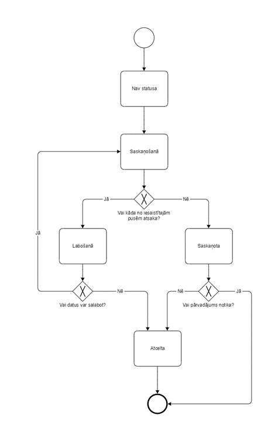
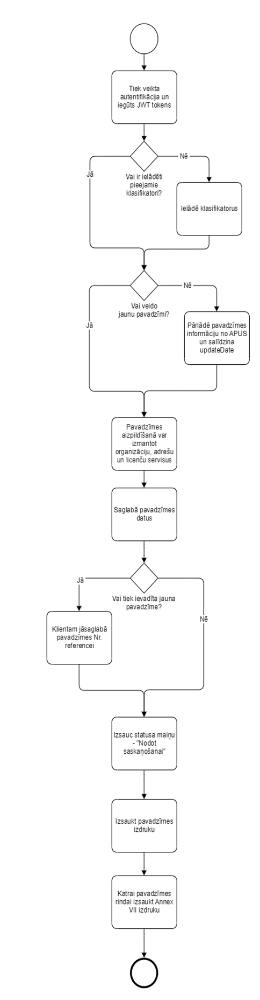
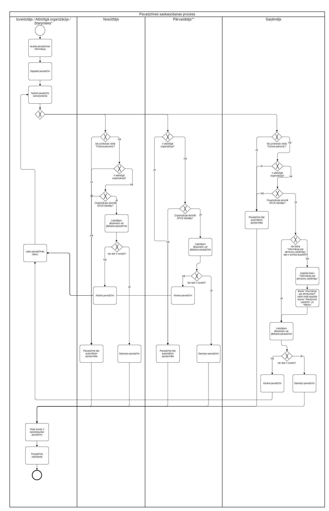

# Procesu diagrammas
## Pavadzīmes statusi un to pārejas

## Pavadzīmes ievadīšanas process

## Pavadzīmes pilns saskaņošanas process

*Sistēma paredz, ka ja pavadzīmē ir starpnieks (atkritumu tirgotājs), tad šis lietotājs vai nu būs atbildīgā persona par pavadzīmi, vai arī uzņēmumam nebūs APUS lietotāja.

**Plūsma attiecas uz katru pavadzīmē pieminēto pārvadātāju
