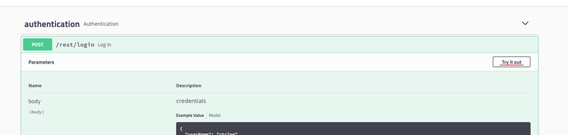
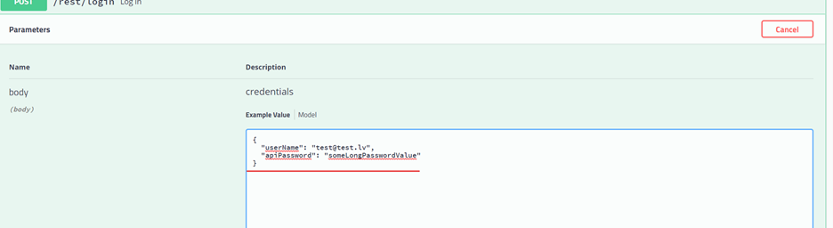
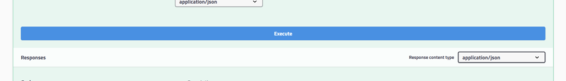
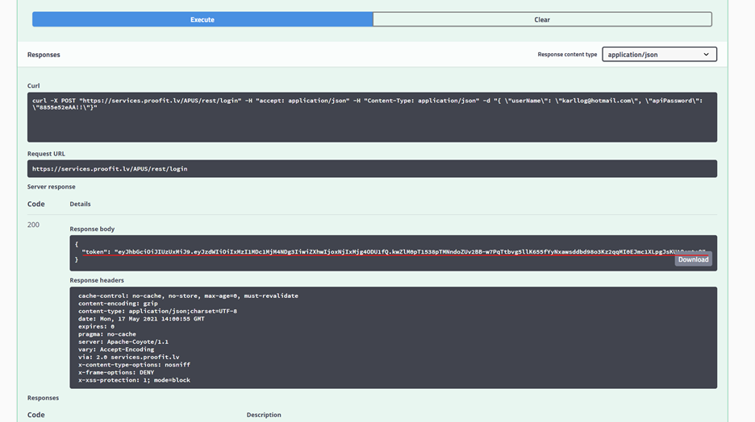
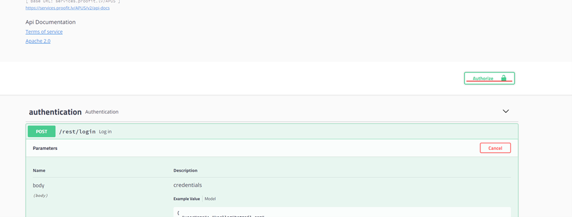
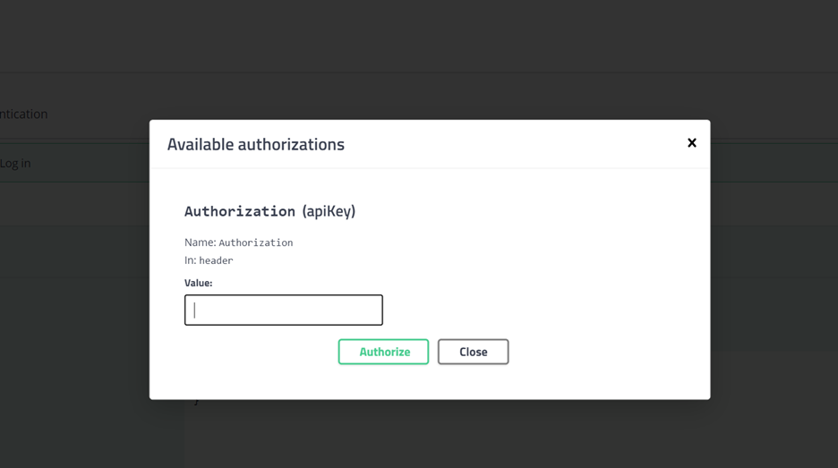
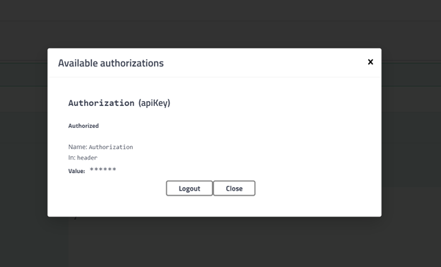

# Swagger UI lietošana

Adrese : (https://services.proofit.lv/APUS/swagger-ui.html)[https://services.proofit.lv/APUS/swagger-ui.html]

APUS izmanto [Swagger UI](https://swagger.io/tools/swagger-ui/) bibliotēku, lai pārlūkā attēlotu pieejamos webservice galapunktus (endpoints).

## Swagger UI
1.	Attēlo pieejamos webservice galapunktus;
2.	Attēlo webservice pieprasījumu datu struktūru;
3.	Attēlo webservice atbildes datu struktūru un iespējamos HTTP kļūdu kodus;
4.	Ļauj izsaukt APUS webservice, norādot parametrus;
5.	Izgūt veiktos pieprasījumus CURL formātā.

## APUS webservice izsaukšana, lietojot Swagger UI

1. Sadaļā “authentication” atver endpoint “/rest/login” un nospiež pogu “Try it out”.

2. Aizpilda lauku “userName” un “apiPassword”

3. Spiež “Execute”

4. Gala rezultātā iegūst autentifikācijai lietojamo JWT token.

5. Nokopē iegūtā token vērtību un nospiež “Authorize” lapas augšpusē

6. Token vērtību ievada laukā “Value” un nospiež “Authorize”

7. Pēc veiksmīgas autentifikācijas, nospiež “Close”

Swagger UI ir veiksmīgi autentificēts un ir iespējams izsaukt citus webservice endpoint, ievadot lietotāju saskarnē obligātos parametrus un saņemot atbildes.
